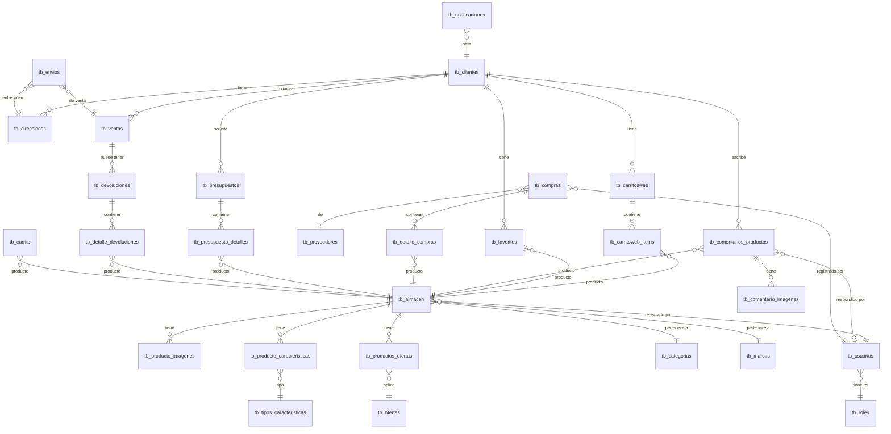
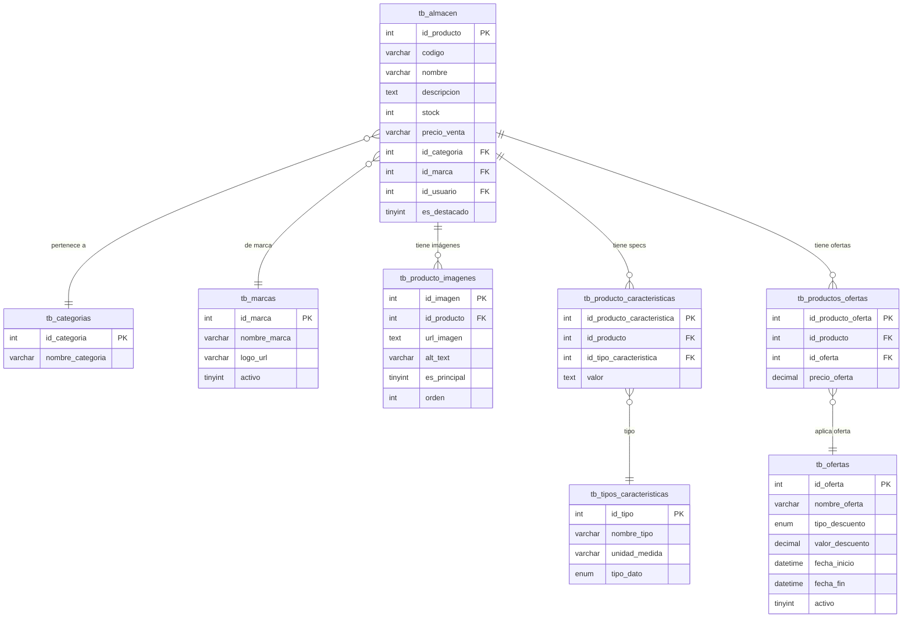
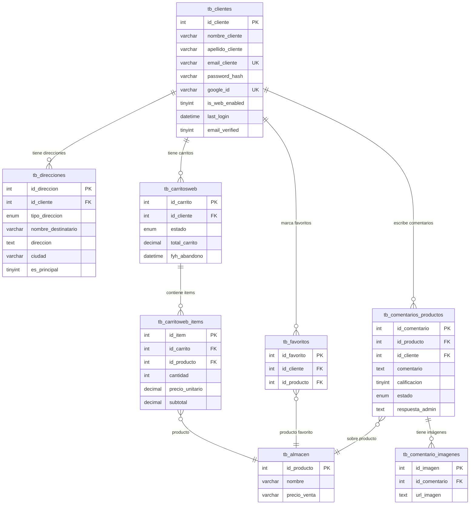
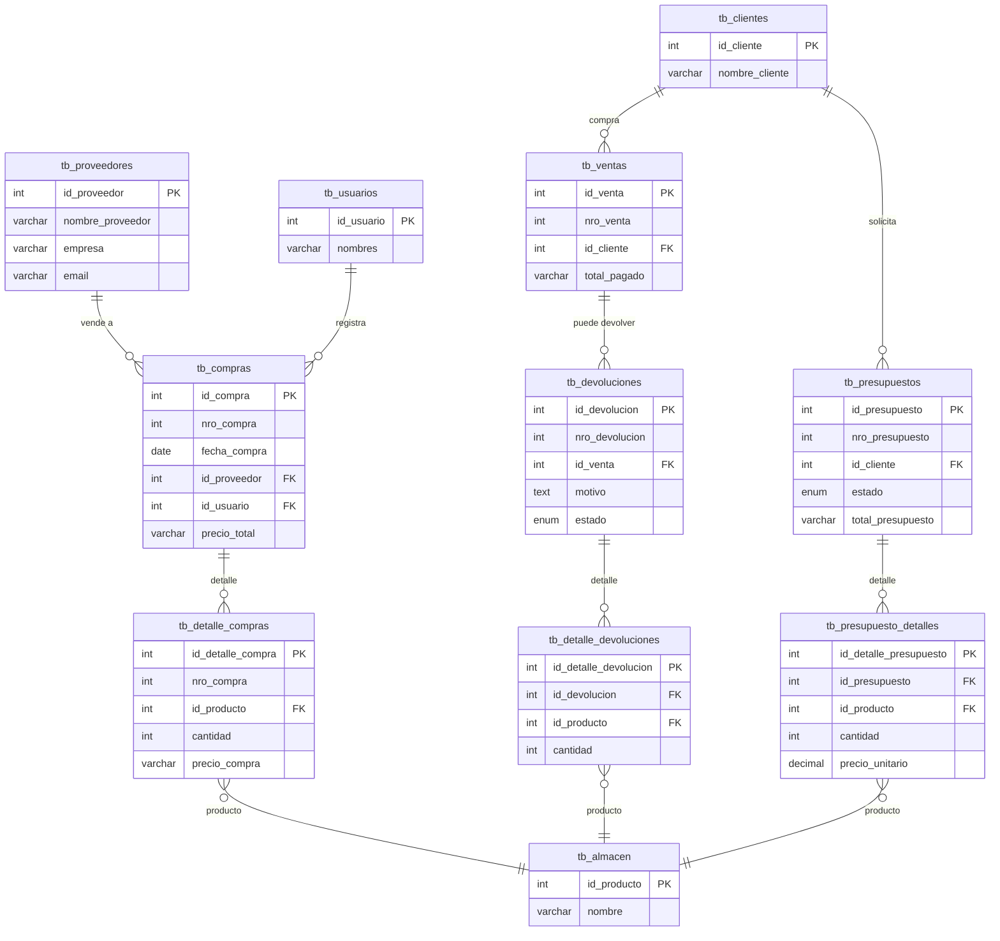
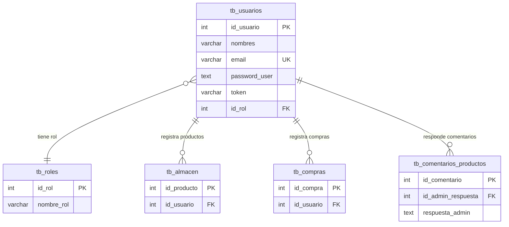

# 📊 Diagramas ER - Base de Datos TecnoCel Web

**Base de datos**: `db_tecnocel_v4`
**Motor**: MariaDB 10.4.27 / MySQL 8.0+
**Total de tablas**: 28

---

## 📋 Índice de Diagramas

1. [Diagrama ER General - Vista Completa](#diagrama-er-general---vista-completa)
2. [Sistema de Productos](#diagrama-sistema-de-productos)
3. [Sistema de Clientes y Carrito Web](#diagrama-sistema-de-clientes-y-carrito-web)
4. [Sistema de Compras y Ventas](#diagrama-sistema-de-compras-y-ventas)
5. [Sistema de Usuarios Admin](#diagrama-sistema-de-usuarios-admin)

---

## Diagrama ER General - Vista Completa

Este diagrama muestra todas las relaciones entre las 28 tablas del sistema.

**Leyenda de Cardinalidad**:
- `||--o{` : Uno a muchos (1:N)
- `}o--||` : Muchos a uno (N:1)
- `}o--o{` : Muchos a muchos (N:M)
- `}o--o|` : Muchos a uno opcional

---

## Diagrama: Sistema de Productos

Sistema completo de gestión de productos con catálogo, imágenes, características y ofertas.

**Tablas involucradas**: 8
- `tb_almacen` (principal)
- `tb_categorias`, `tb_marcas` (catálogos)
- `tb_producto_imagenes` (multimedia)
- `tb_producto_caracteristicas`, `tb_tipos_caracteristicas` (especificaciones técnicas)
- `tb_ofertas`, `tb_productos_ofertas` (descuentos y promociones)

**Relaciones clave**:
- Un producto pertenece a una categoría y marca
- Un producto puede tener múltiples imágenes (1:N)
- Un producto puede tener múltiples características (1:N)
- Un producto puede tener múltiples ofertas (N:M vía tb_productos_ofertas)

---

## Diagrama: Sistema de Clientes y Carrito Web

Sistema de clientes con autenticación, carrito de compras, favoritos y comentarios.

**Tablas involucradas**: 8
- `tb_clientes` (principal)
- `tb_direcciones` (envío y facturación)
- `tb_carritosweb`, `tb_carritoweb_items` (carrito de compras)
- `tb_favoritos` (lista de deseos)
- `tb_comentarios_productos`, `tb_comentario_imagenes` (reseñas)
- `tb_almacen` (referencia a productos)

**Flujos principales**:
1. **Registro/Login**: Cliente se registra con email/password o Google OAuth
2. **Exploración**: Cliente navega productos y marca favoritos
3. **Compra**: Cliente agrega productos al carrito
4. **Envío**: Cliente selecciona dirección de entrega
5. **Post-compra**: Cliente deja comentarios y calificaciones

**Estados del carrito**:
- `activo`: En uso
- `completado`: Compra finalizada
- `abandonado`: Para remarketing

---

## Diagrama: Sistema de Compras y Ventas

Sistema completo de transacciones comerciales: compras a proveedores, ventas, presupuestos y devoluciones.

**Tablas involucradas**: 12

**Subsistema de Compras** (4 tablas):
- `tb_proveedores` - Proveedores
- `tb_compras` - Órdenes de compra
- `tb_detalle_compras` - Items comprados
- Relación con `tb_usuarios` (quien registra)

**Subsistema de Ventas** (2 tablas):
- `tb_ventas` - Ventas realizadas
- Relación con `tb_clientes`

**Subsistema de Presupuestos** (2 tablas):
- `tb_presupuestos` - Cotizaciones
- `tb_presupuesto_detalles` - Items cotizados
- Estados: pendiente, aprobado, rechazado

**Subsistema de Devoluciones** (2 tablas):
- `tb_devoluciones` - Registro de devoluciones
- `tb_detalle_devoluciones` - Items devueltos
- Estados: pendiente, aprobado, rechazado

**Flujos de negocio**:
1. **Compra**: Proveedor → Compra → Detalle → Actualiza stock
2. **Venta**: Cliente → Venta → Reduce stock
3. **Presupuesto**: Cliente solicita → Admin cotiza → Aprueba/Rechaza
4. **Devolución**: Cliente devuelve → Admin aprueba → Restaura stock

---

## Diagrama: Sistema de Usuarios Admin

Sistema de administración con roles y permisos.

**Tablas involucradas**: 5
- `tb_usuarios` - Administradores del sistema
- `tb_roles` - Roles (Administrador, Vendedor, Almacenero)
- Relaciones con productos, compras y comentarios

**Diferencia con tb_clientes**:
- `tb_usuarios`: Administradores del sistema backend/POS
- `tb_clientes`: Clientes de la tienda web

**Roles típicos**:
- **Administrador**: Acceso total
- **Vendedor**: Solo ventas
- **Almacenero**: Solo inventario

**Acciones de usuarios admin**:
1. Registrar productos en el almacén
2. Registrar compras a proveedores
3. Responder comentarios de clientes
4. Gestionar el sistema punto de venta

---

## 📚 Convenciones de Diagramas

### Tipos de Datos Comunes

| Tipo | Descripción |
|------|-------------|
| `int` | Entero, usualmente IDs |
| `varchar(n)` | Cadena de texto variable |
| `text` | Texto largo |
| `decimal(m,n)` | Número decimal (precios) |
| `datetime` | Fecha y hora |
| `date` | Solo fecha |
| `enum` | Lista de valores permitidos |
| `tinyint(1)` | Booleano (0 o 1) |

### Tipos de Claves

| Abreviación | Significado |
|-------------|-------------|
| `PK` | Primary Key (Clave Primaria) |
| `FK` | Foreign Key (Clave Foránea) |
| `UK` | Unique Key (Clave Única) |

### Cardinalidad de Relaciones

| Símbolo | Significado | Ejemplo |
|---------|-------------|---------|
| `||--o{` | Uno a Muchos (1:N) | Un cliente tiene muchos carritos |
| `}o--||` | Muchos a Uno (N:1) | Muchos productos pertenecen a una marca |
| `}o--o{` | Muchos a Muchos (N:M) | Productos y ofertas (vía tabla intermedia) |
| `}o--o|` | Muchos a Uno Opcional | Comentario puede tener respuesta admin |

---

## 🔍 Cómo Usar Estos Diagramas

### En Desarrollo

**Consultar relaciones**:
- Al hacer JOIN en SQL, verifica las FK en estos diagramas
- Al crear nuevas features, revisa qué tablas están relacionadas

**Diseñar nuevas funcionalidades**:
- Identifica qué tablas necesitas modificar/crear
- Verifica el impacto en tablas relacionadas

### En Documentación

**Para nuevos desarrolladores**:
- Primero revisa el diagrama general
- Luego profundiza en el subsistema específico
- Consulta [SCHEMA.md](./SCHEMA.md) para detalles de columnas

**Para diseño de features**:
- Usa estos diagramas en documentos de diseño
- Referencia específica: "Ver Diagrama de Clientes en DIAGRAMS.md"

---

## 📖 Recursos Relacionados

- [SCHEMA.md](./SCHEMA.md) - Documentación completa del esquema con todas las columnas
- [IMPROVEMENTS_PLAN.md](./IMPROVEMENTS_PLAN.md) - Plan de mejoras de la BD
- [README.md](./README.md) - Índice de documentación de database

---

**Última actualización**: 7 de Octubre, 2025
**Versión de la BD**: 4.0
**Formato**: Mermaid ERD (Entity Relationship Diagram)

[← Volver al índice de database](./README.md) | [← Volver a SCHEMA.md](./SCHEMA.md)

---

**[⬆ Volver arriba](#tabla-de-contenidos)** | **[📚 Documentación](../README.md)** | **[🏠 Inicio](../../README.md)**
