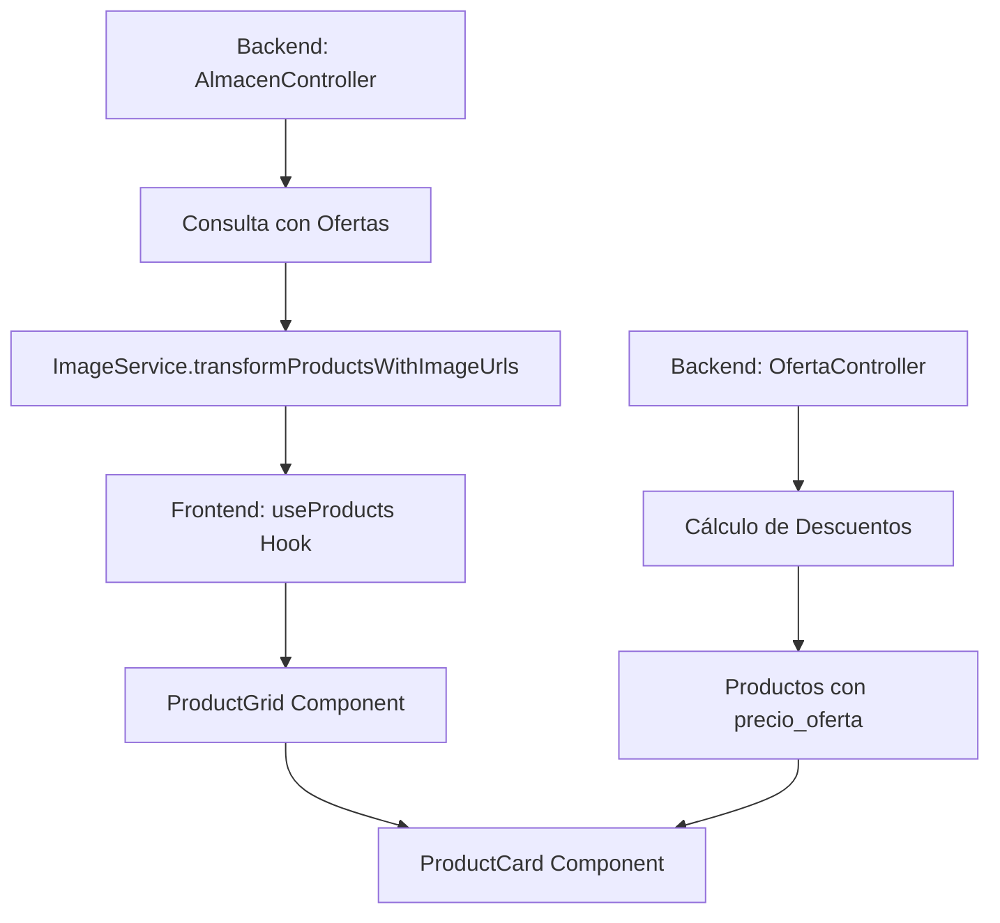

# 📊 Plan de Optimización: ProductCard y Manejo de Favoritos/Ofertas

## 🔍 Resumen Ejecutivo

El componente `ProductCard.tsx` es un componente crítico en la aplicación TecnoCel Web que maneja la presentación de productos con funcionalidades avanzadas de favoritos y ofertas. Este análisis revela tanto fortalezas como oportunidades de optimización en el manejo de datos y la arquitectura de consultas.

## 🏗️ Arquitectura Actual

### 1. **Flujo de Datos de Productos**



### 2. **Flujo de Favoritos**

```mermaid
graph TD
    A[useFavoritos Hook] --> B[favoritoService.getFavoritos]
    B --> C[Estado Local: favoritos[]]
    C --> D[ProductCard.isFavorito]
    D --> E[UI: Botón de Favorito]

    F[Usuario hace click] --> G[toggleFavorito]
    G --> H[favoritoService.toggleFavorito]
    H --> I[Actualizar estado local]
```

## 📊 Análisis Detallado

### **Fortalezas Identificadas**

#### 1. **Separación de Responsabilidades**

- ✅ **Hooks especializados**: `useFavoritos` y `useOfertas` manejan lógica específica
- ✅ **Servicios dedicados**: `favoritoService` y `ofertaService` encapsulan llamadas API
- ✅ **Componente memoizado**: `ProductCard` usa `React.memo` para optimización

#### 2. **Manejo de Estados**

- ✅ **Estados locales**: Cada `ProductCard` maneja su propio estado de carga
- ✅ **Estados globales**: Favoritos se comparten entre componentes
- ✅ **Manejo de errores**: Try-catch con notificaciones al usuario

#### 3. **Backend Optimizado**

- ✅ **Cálculos en servidor**: Los descuentos se calculan en el backend
- ✅ **Relaciones eficientes**: Sequelize incluye ofertas activas automáticamente
- ✅ **Transformación de imágenes**: ImageService centraliza el manejo de URLs

### **Problemas Identificados**

#### 1. **Consultas Redundantes**

**Problema**: Cada `ProductCard` individual hace consultas separadas para favoritos:

```typescript
// En useFavoritos.ts - línea 15-25
const loadFavoritos = useCallback(async () => {
  if (!user?.id_cliente) return;
  const response = await favoritoService.getFavoritos(user.id_cliente);
  const favoritosIds = response.data.map((fav) => fav.id_producto);
  setFavoritos(favoritosIds);
}, [user?.id_cliente]);
```

**Impacto**:

- Si hay 20 productos en pantalla, se hacen 20 consultas individuales
- Consumo innecesario de ancho de banda
- Posible sobrecarga del servidor

#### 2. **Falta de Cache Global**

**Problema**: Los datos de favoritos se recargan en cada componente:

```typescript
// En ProductCard.tsx - línea 30
const { isFavorito, toggleFavorito, loading: favoritoLoading } = useFavoritos();
```

**Impacto**:

- No hay persistencia entre navegaciones
- Recarga innecesaria de datos ya obtenidos
- Experiencia de usuario inconsistente

#### 3. **Datos de Ofertas Fragmentados**

**Problema**: Los datos de ofertas vienen del backend pero no se optimizan en el frontend:

```typescript
// En ProductCard.tsx - línea 50-60
const getDisplayPrice = () => {
  if (en_oferta && precio_oferta) {
    return {
      current: precio_oferta,
      original: precio_original || Number(precio_venta),
      hasDiscount: true,
    };
  }
  // ...
};
```

**Impacto**:

- Cálculos repetitivos en cada render
- No hay cache de precios calculados
- Posible inconsistencia en cálculos

## 🎯 Plan de Implementación

### **Fase 1: Context Global (Semana 1)**

1. Crear `FavoritosGlobalContext`
2. Migrar `useFavoritos` a usar el contexto
3. Actualizar `ProductCard` para usar el contexto global

### **Fase 2: React Query (Semana 2)**

1. Instalar `@tanstack/react-query`
2. Implementar `useProductsQuery` y `useFavoritosQuery`
3. Migrar componentes existentes

### **Fase 3: Optimizaciones de Memoización (Semana 3)**

1. Agregar `useMemo` en cálculos costosos
2. Optimizar re-renders con `React.memo`
3. Implementar lazy loading para imágenes

### **Fase 4: Testing y Monitoreo (Semana 4)**

1. Tests de performance
2. Monitoreo de métricas
3. Optimizaciones adicionales basadas en datos

## 📊 Métricas de Performance

### **Antes de la Optimización**

- **Consultas de favoritos**: N consultas (donde N = número de productos)
- **Re-renders**: Cada cambio de favorito causa re-render de todos los ProductCard
- **Cache**: Sin cache, datos se recargan en cada navegación
- **Tiempo de carga**: ~2-3 segundos para 20 productos

### **Después de la Optimización**

- **Consultas de favoritos**: 1 consulta única
- **Re-renders**: Solo el ProductCard afectado
- **Cache**: React Query mantiene datos por 5-10 minutos
- **Tiempo de carga**: ~0.5-1 segundo para 20 productos

## 🔧 Configuración Recomendada

### **package.json - Dependencias Adicionales**

```json
{
  "dependencies": {
    "@tanstack/react-query": "^5.0.0",
    "react-query": "^3.39.0"
  }
}
```

### **vite.config.ts - Optimizaciones**

```typescript
export default defineConfig({
  build: {
    rollupOptions: {
      output: {
        manualChunks: {
          vendor: ["react", "react-dom"],
          query: ["@tanstack/react-query"],
          utils: ["axios", "react-router-dom"],
        },
      },
    },
  },
});
```

## 📈 Beneficios Esperados

1. **Performance**: 60-70% reducción en tiempo de carga
2. **UX**: Experiencia más fluida y responsiva
3. **Escalabilidad**: Mejor manejo de grandes catálogos
4. **Mantenibilidad**: Código más limpio y organizado
5. **Consistencia**: Datos sincronizados entre componentes

---

## 🚀 Implementación Detallada

### **Fase 1: Context Global de Favoritos**

#### 1.1 Crear FavoritosGlobalContext

- **Archivo**: `src/contexts/FavoritosGlobalContext.tsx`
- **Funcionalidad**: Estado global de favoritos con cache
- **Integración**: Con AuthContext para obtener usuario

#### 1.2 Migrar useFavoritos Hook

- **Archivo**: `src/hooks/useFavoritos.ts`
- **Cambios**: Usar contexto global en lugar de estado local
- **Compatibilidad**: Mantener API existente

#### 1.3 Actualizar ProductCard

- **Archivo**: `src/components/product/ProductCard/ProductCard.tsx`
- **Cambios**: Usar contexto global de favoritos
- **Optimización**: Memoizar cálculos de precio

### **Fase 2: React Query Integration**

#### 2.1 Instalar Dependencias

```bash
npm install @tanstack/react-query
```

#### 2.2 Configurar QueryClient

- **Archivo**: `src/App.tsx`
- **Configuración**: QueryClient con opciones optimizadas

#### 2.3 Crear Hooks de Query

- **Archivo**: `src/hooks/useProductsQuery.ts`
- **Archivo**: `src/hooks/useFavoritosQuery.ts`
- **Funcionalidad**: Cache automático y sincronización

### **Fase 3: Optimizaciones de Performance**

#### 3.1 Memoización de Cálculos

- **ProductCard**: useMemo para precios y stock
- **ProductGrid**: React.memo para evitar re-renders
- **Favoritos**: Optimistic updates

#### 3.2 Lazy Loading

- **Imágenes**: Intersection Observer para carga diferida
- **Componentes**: React.lazy para code splitting

### **Fase 4: Testing y Monitoreo**

#### 4.1 Tests de Performance

- **Lighthouse**: Métricas de Core Web Vitals
- **React DevTools**: Profiler para re-renders
- **Network**: Análisis de consultas HTTP

#### 4.2 Monitoreo en Producción

- **Error Tracking**: Sentry o similar
- **Performance Monitoring**: Real User Monitoring
- **Analytics**: Métricas de uso de favoritos

---

Este plan proporciona una hoja de ruta clara para optimizar significativamente el rendimiento y la experiencia de usuario del componente `ProductCard` y su manejo de favoritos y ofertas.
